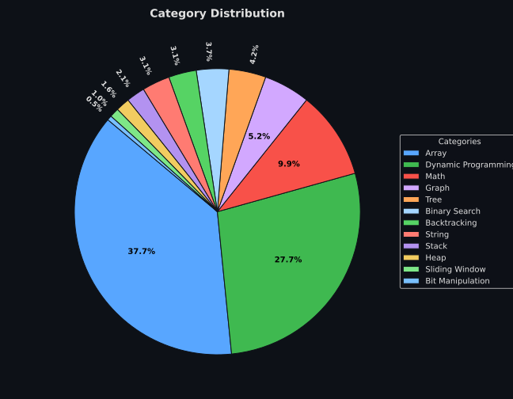

# Data Structures & Algorithms

_Curated collection of Data Structures & Algorithms solutions for interview preparation and competitive programming._

---

## About the Repository

This repository tracks solved Data Structures and Algorithms (DSA) problems, meticulously organized by algorithmic category. It serves as a comprehensive **learning dashboard and progress tracker**.

**The goal of this repository is to:**

- **Strengthen algorithmic thinking** and problem-solving fundamentals.
- **Prepare comprehensively for coding interviews** at top tech companies.
- **Master common algorithm patterns** and recognize when to apply them.

All problems are implemented with **clean, optimized Python solutions**, focusing on readability, time complexity, and space efficiency.

---

## Topic Coverage Distribution

---

## Algorithm Coverage

This repository covers a wide spectrum of essential data structures and algorithms patterns:

- **Searching Algorithms:** Linear Search, Binary Search, Quick Select.
- **Graph Traversal:** Breadth-First Search (BFS), Depth-First Search (DFS), Dijkstra's, Topological Sort.
- **Recursion & Backtracking:** Generating subsets, permutations, combinations, and solving constraint satisfaction problems.
- **Dynamic Programming:** Memoization, tabulation, knapsack problems, sequence alignment.
- **Greedy Algorithms:** Local optimal choices to find global optimums.
- **Sliding Window Technique:** Fixed and variable length window optimizations for arrays/strings.
- **Tree Traversal Algorithms:** Pre-order, in-order, post-order, level-order traversal, and BST operations.
- **Heap & Priority Queue:** Top K elements, merging sorted lists, scheduling.
- **Bit Manipulation:** XOR tricks, masking, and optimizing space-time complexity.

Each solution is designed to quickly demonstrate **efficient implementations** and **reusable algorithm patterns**.

---

  <i>Continually updated to reflect an ongoing professional DSA learning journey and algorithm mastery tracker.</i>

